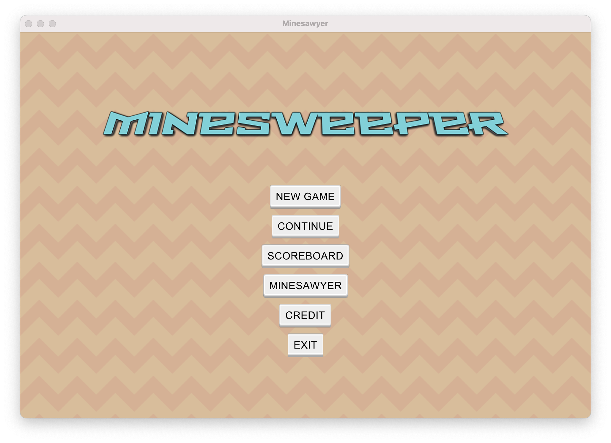
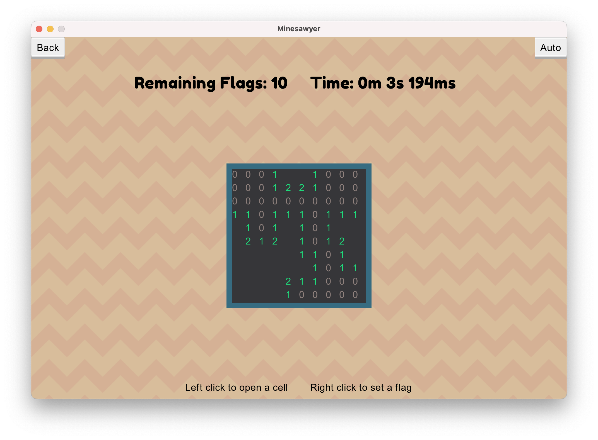
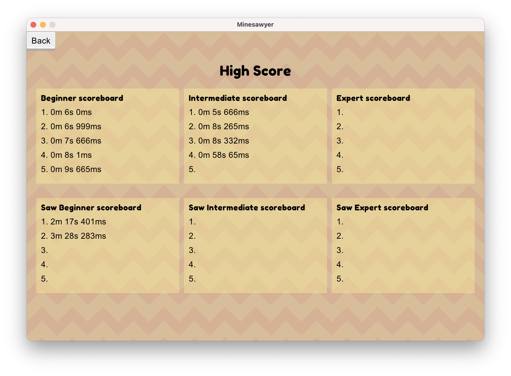

# Description
Minesweeper clone with a simple solver.

# Features
- 3 different difficulties
- Randomly generated board
- Timer
- Scoreboard
- Save current game
- Auto solver
- Custom mode: Minesawyer

# Screenshots
<figure style="display: grid; place-items: center">
    
    <figcaption>Main menu</figcaption>
</figure>

<figure style="display: grid; place-items: center">
    
    <figcaption>Gameplay</figcaption>
</figure>

<figure style="display: grid; place-items: center">
    
    <figcaption>Scoreboard</figcaption>
</figure>

# Setup Guide
- Clone the repo and cd to the repos' directory
- Install [Homebrew](https://brew.sh/)
```bash
$ /bin/bash -c "$(curl -fsSL https://raw.githubusercontent.com/Homebrew/install/HEAD/install.sh)"
```
- Install Ruby (>3.1.1) with Rbenv
```bash
$ brew install rbenv
$ rbenv install 3.1.1
$ rbenv local 3.1.1
```
- Install dependencies
```bash
$ gem install bundler
$ bundle install
```
- Run the main file
```bash
$ ruby main.rb
```
